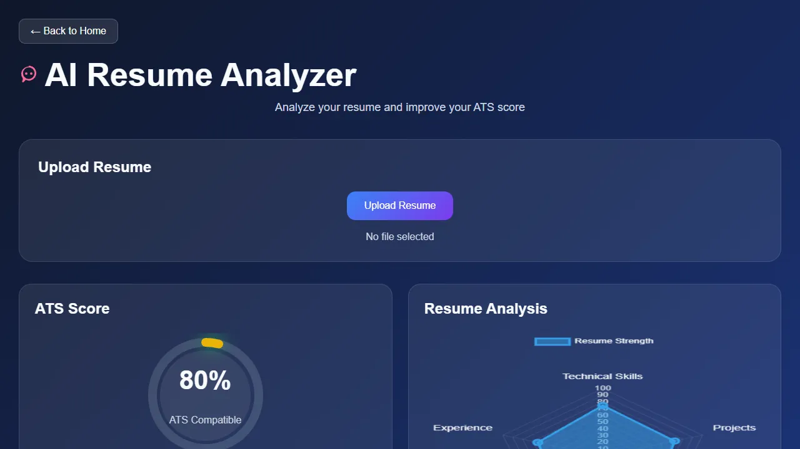

<div align="center">

# 💬 AI Resume Analyser

**A smart, browser-based tool that evaluates your resume for ATS compatibility and provides AI-powered insights—no backend or login required.**

[](https://gssoc.girlscript.org/projects/dhairyagothi%2F100_days_100_web_project)
[](https://github.com/dhairyagothi/100_days_100_web_project/tree/Main/public/AI-Resume-Analyser)
[](https://100-days-100-web-project.vercel.app/public/AI-Resume-Analyser/index.html)

### 🚀 [Try the Live Analyser Here](https://100-days-100-web-project.vercel.app/public/AI-Resume-Analyser/index.html)

</div>

<br/>

## 🌌 About The Project

Navigating applicant tracking systems can be a black box. This AI Resume Analyser allows users to upload their resumes directly in the browser to receive instant ATS compatibility scores, skill breakdowns, and actionable AI-powered suggestions. All processing is done securely on the client side, ensuring privacy and speed.

---

## ✨ Key Features

### 🧠 Resume Analysis
* **ATS Compatibility Score:** Evaluates your resume based on important sections and relevant keywords.
* **Skills Analysis:** Identifies technical skills found in your resume.
* **Resume Statistics:** Displays word count, character count, reading time, file size, and last modified date.
* **Section Analysis:** Reviews key sections such as Contact, Summary, Education, Experience, Skills, and Projects.

### 🎯 Job Description Matching
* **Skill Matching:** Compare your resume against a job description.
* **Matched Skills:** See skills that appear in both your resume and the job description.
* **Missing Skills:** Identify skills mentioned in the job description that are not detected in your resume.

### 📊 Visual Insights
* **Radar Chart:** Visualizes performance across Technical Skills, Projects, Communication, Experience, and ATS Keywords.
* **Progress Indicators:** Displays category-wise analysis scores.

### 🖥️ User Experience
* **Multiple File Formats:** Supports PDF, DOCX, and TXT resumes.
* **Drag & Drop:** Upload your resume by dragging it into the upload area or selecting it manually.
* **Dark/Light Mode:** Switch between themes for a more comfortable viewing experience.
* **Export Report:** Download your analysis results as a text report.
* **Copy Suggestions:** Copy improvement suggestions directly to your clipboard.

---

## 🔍 How the Analysis Works

The analyser evaluates your resume using several criteria:

* **ATS Compatibility** — Checks important resume sections and relevant keywords.
* **Skills Analysis** — Identifies technical skills found in the resume.
* **Job Description Matching** — When a job description is provided, the analyser compares it with your resume and highlights matched and missing skills.
* **Resume Statistics** — Provides information such as word count, character count, reading time, and file size.
* **Section Analysis** — Reviews sections such as Contact, Summary, Education, Experience, Skills, and Projects.

The results are presented through scores, progress indicators, and visual charts to help you identify areas where your resume can be improved.

---

## 🛠️ Technologies Used

* **HTML5** — Provides the structure and interface of the application.
* **CSS3** — Handles responsive styling, animations, and dark/light themes.
* **JavaScript (ES6+)** — Powers resume parsing, analysis, skill matching, statistics, and user interactions.
* **Chart.js** — Used to display the resume analysis radar chart.
* **PDF.js** — Used to extract text from PDF resumes.
* **Mammoth.js** — Used to extract text from DOCX resumes.

---

## 📄 Supported Resume Formats

The analyser currently supports the following resume file formats:

| Format | Description |
|---|---|
| **PDF** | Extracts text from PDF resumes for analysis |
| **DOCX** | Extracts text from Microsoft Word documents |
| **TXT** | Reads plain-text resumes directly |

You can upload a resume by clicking the upload area or by dragging and dropping the file into the analyser.

---

## 🚀 Installation & Setup

Want to run the analyser locally? Follow these steps:

1. **Clone the repository:**
   ```bash
   git clone [https://github.com/dhairyagothi/100_days_100_web_project.git](https://github.com/dhairyagothi/100_days_100_web_project.git)
   ```
2. **Navigate to the project directory:**
   ```bash
   cd 100_days_100_web_project/public/AI-Resume-Analyser
   ```
3. **Launch the application:**
   Open `index.html` directly in your browser, or use an extension like VS Code Live Server for the best development experience.

---

## 📖 How to Use

1. **Open** the app in your web browser.
2. **Upload** a PDF, DOCX, or TXT resume (via click or drag-and-drop).
3. **Wait** a moment while the analyser processes your document.
4. **Review** your ATS score, radar chart analysis, and category-wise insight breakdowns.
5. **Explore** your detailed resume statistics (word count, reading time, etc.).
6. **Act** on the feedback by clicking the "Copy Suggestions" button, or download the full analysis report for later.

---

## 📸 Preview



---

## 🛠️ Troubleshooting

* **Resume is not being analysed:** Make sure the uploaded file is a valid PDF, DOCX, or TXT file.
* **PDF/DOCX text is not extracted correctly:** Try uploading a text-based document rather than a scanned image or heavily formatted file.
* **The analysis does not appear:** Refresh the page and upload the resume again.
* **Download or copy actions do not work:** Make sure your browser allows downloads and clipboard access for the page.
* **Unexpected behaviour:** Open your browser's developer console and check for JavaScript errors.

If the problem persists, please open an issue in the repository with details about the problem, steps to reproduce it, and screenshots if possible.

---

## 🤝 Contributing

Contributions are welcome! If you'd like to improve the AI Resume Analyser:

1. Fork the repository.
2. Create a new branch for your changes.
3. Make your changes and test them locally.
4. Commit your changes with a clear commit message.
5. Push your branch to your fork.
6. Open a Pull Request describing your changes.

Before contributing, please read the repository's [Contributing Guidelines](../../CONTRIBUTING.md).

---

## 📜 License & Credits

* **License:** This project is licensed under the MIT License.
* **Project:** Built as part of the [100 Days 100 Web Projects](https://github.com/dhairyagothi/100_days_100_web_project) challenge.

### Contributor
* **Ananya Joshi** *GSSoC 2026 Contributor*
* **Rajendra Ambawatiya** — *README documentation improvements*