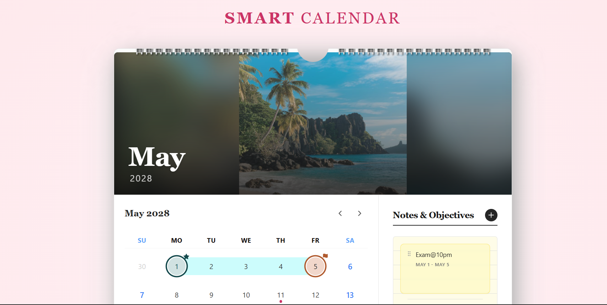
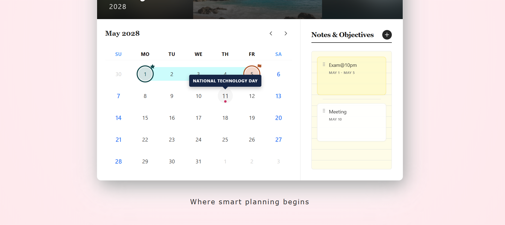

#🗓️ Smart Calendar
A modern, interactive desk calendar built to deliver a clean and engaging user experience.
This project focuses on combining aesthetic design with practical features like date range selection, draggable notes, and dynamic monthly visuals.

Where smart planning begins.

#✨ Features
📸 Dynamic Monthly Visuals
The calendar header updates based on the current month, giving a fresh and visually appealing look without image distortion.

📝 Interactive Notes Panel
Notes are fully interactive—drag, reorder, and pin them to stay organized and prioritize tasks easily.

📅 Date Range Selection
Select a range of dates directly from the calendar and link them with notes for better planning.

✏️ Quick Day Labels
Double-click on any date to add small custom labels like “Meeting” or “Mom’s Birthday”.

🎉 Holiday Indicators
Important holidays are highlighted with subtle markers and tooltips for quick reference.

#🛠️ Tech Stack
**React **
Tailwind CSS + CSS Modules
Framer Motion (animations & drag interactions)
date-fns (date handling)

#⚙️ Implementation Details
CSS Modules + Tailwind
Combined for better styling control and reusable UI components without class conflicts.

date-fns for Date Handling
Lightweight and efficient library for managing dates using native JavaScript Date objects.

Framer Motion
Used for smooth animations, transitions, and drag-and-drop interactions.

Canvas-Based Image Rendering
Ensures images display properly across all screen sizes without cropping or distortion.

#Screenshots: 

#Author
Maddu Jayasree