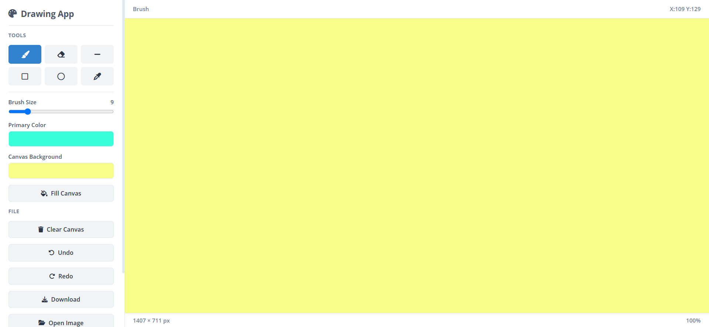

# Drawing App

A simple browser-based drawing application built with HTML, CSS, and JavaScript. It provides a collection of drawing tools and canvas controls for creating, editing, importing, and downloading drawings directly in the browser.

## Features

### Drawing Tools

- **Brush** — Draw freehand strokes with an adjustable size.
- **Eraser** — Erase parts of the drawing using an adjustable size.
- **Line** — Draw straight lines.
- **Rectangle** — Draw rectangular outlines.
- **Circle** — Draw circular outlines.
- **Color Picker** — Pick a color directly from the canvas and use it for subsequent drawing.

### Canvas Controls

- Adjustable brush size from **1–50 px**
- Primary color selection
- Canvas background color selection
- Fill the entire canvas with the selected primary color
- Clear the canvas using the selected background color
- Canvas dimensions displayed in the status bar
- Current mouse coordinates displayed while drawing

### History

- **Undo** drawing actions
- **Redo** undone actions
- Maintains up to **30 canvas states** in the undo history

### Image & File Operations

- Open an image from your local device
- Automatically scale and center imported images while preserving their proportions
- Download the current canvas as a PNG image
- Keyboard shortcut for downloading the drawing

### Keyboard Shortcuts

| Shortcut | Action |
| --- | --- |
| `Ctrl + Z` | Undo |
| `Ctrl + Y` | Redo |
| `Ctrl + S` | Download drawing |

## Tech Stack

### Core Technologies

- **HTML5** — Provides the structure of the application and its user interface.
- **CSS3** — Handles the layout, styling, controls, and visual appearance.
- **JavaScript** — Implements the drawing tools, canvas operations, history management, image handling, downloads, and keyboard shortcuts.
- **HTML5 Canvas API** — Used for drawing and manipulating canvas content.

### External Resources

- **Font Awesome** — Provides icons used throughout the interface.
- **Google Fonts (Open Sans)** — Used for typography.

## Folder Structure

```text
Drawing-Canva/
├── index.html    # Application structure and UI
├── index.js      # Drawing functionality and application logic
├── style.css     # Styling and layout
└── README.md     # Project documentation
```

## How to Run Locally

### Prerequisites

A modern web browser such as Google Chrome, Microsoft Edge, or Mozilla Firefox.

### Steps

1. Clone the repository:

   ```bash
   git clone https://github.com/dhairyagothi/100_days_100_web_project.git
   ```

2. Navigate to the project directory:

   ```bash
   cd 100_days_100_web_project/public/Drawing-Canva
   ```

3. Open `index.html` in a web browser.

   Alternatively, you can use a local development server such as the **Live Server** extension in VS Code.

No additional dependencies or package installation are required.

## Usage

1. Open `index.html` in a web browser.
2. Select a drawing tool from the toolbar.
3. Use the **Brush Size** slider to adjust the stroke thickness.
4. Choose a **Primary Color** for drawing.
5. Use the **Canvas Background** color control for the canvas background used when clearing the canvas.
6. Draw directly on the canvas using your mouse.
7. Use **Undo** and **Redo** to manage previous drawing states.
8. Select **Color Picker** and click on an existing part of the canvas to pick its color.
9. Select **Open Image** to import an image from your device.
10. Use **Download** or press `Ctrl + S` to save the current drawing as a PNG image.

## Screenshots



## Notes

- The application runs entirely in the browser.
- No backend or database is required.
- No additional packages or dependencies need to be installed.