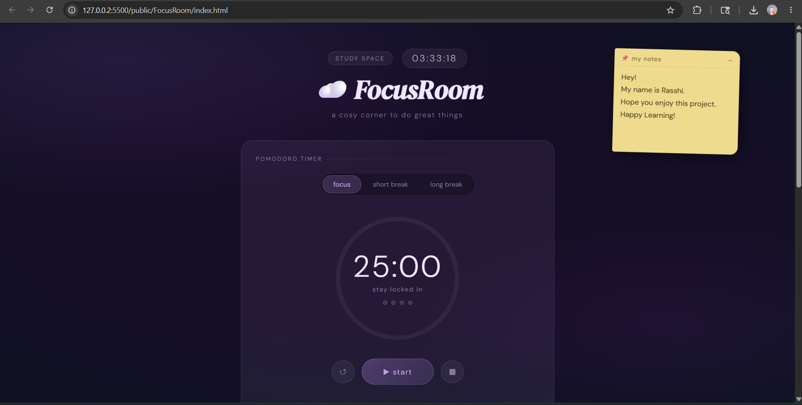
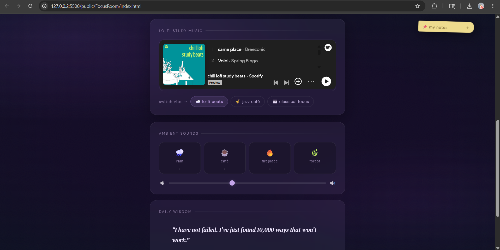
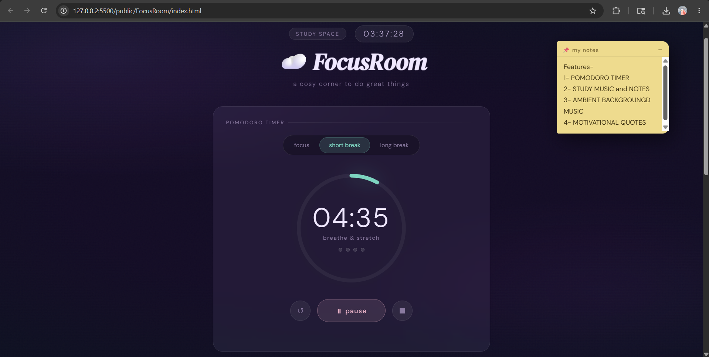
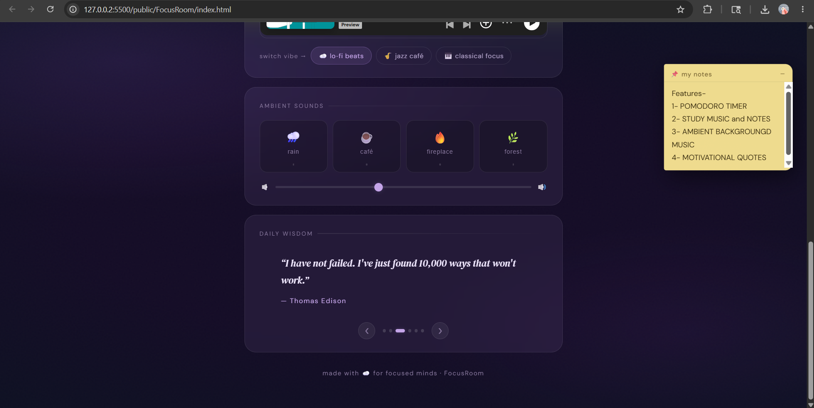
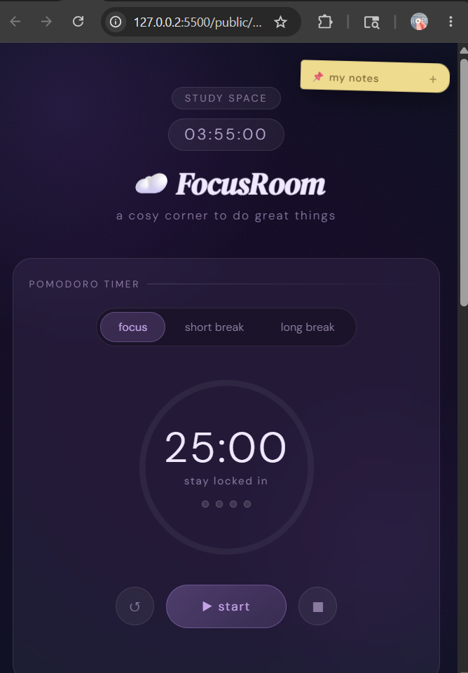

# ⚡ FocusForge — Pomodoro Focus Timer

A modern, feature-rich Pomodoro timer web app built with pure HTML, CSS, and JavaScript. Stay productive with timed focus sessions, structured breaks, motivational quotes, and a beautiful glassmorphism dark-mode UI.

---

## Description

<<<<<<< HEAD
### ⏳ Pomodoro Timer

- Focus, Short Break, and Long Break modes
- Circular animated progress ring
- Start, Pause, Resume, and Reset controls
- Session tracking with visual indicators
- Dynamic browser tab timer updates

### 🕒 Live Digital Clock

- Real-time clock display
- Updates every second automatically

### 📝 Sticky Notes

- Draggable sticky note widget
- Write reminders, ideas, or tasks
- Minimize and expand functionality

### 🎨 Aesthetic User Interface

- Minimal and cosy design
- Ambient background layers and glow effects
- Smooth transitions and animations
- Fully responsive layout

### 🔔 Productivity Experience

- Visual feedback and notifications
- Clean workspace focused on reducing distractions
- Designed for studying, coding, and deep work sessions
=======
FocusForge applies the **Pomodoro Technique** to help you achieve deep, distraction-free work. Work in focused sprints, take structured breaks, track completed sessions, and stay motivated — all from a single HTML file with no build tools or dependencies required.
>>>>>>> 36ee3a455b60a328b5c69b168da900508aced8eb

---

## Features

<<<<<<< HEAD
- **HTML5** – Structure of the application
- **CSS3** – Styling, animations, and responsive design
- **JavaScript (Vanilla JS)** – Functionality and interactivity
- **Google Fonts** – Typography and aesthetic UI design
=======
| Feature | Details |
|---|---|
| ⏱ Pomodoro Timer | 25-min focus / 5-min break (fully customizable) |
| ▶ Controls | Start, Pause, Reset, Skip |
| 🔄 Auto-switch | Automatically transitions focus → break → focus |
| 🎯 Session Counter | Tracks completed focus sessions (persisted) |
| 🔔 Sound Notification | Web Audio API chime — no external audio files |
| 🌐 Browser Notifications | Optional desktop push notifications |
| 💬 Motivational Quotes | 24 handpicked quotes shown after each focus session |
| 💾 LocalStorage | Persists settings, session count, and theme |
| 🌙 Theme Toggle | Dark (default) and Light modes |
| 📱 Responsive | Desktop, tablet, and mobile friendly |
| ⌨ Keyboard Shortcuts | `Space`, `R`, `S`, `Esc` |
| ♿ Accessible | Semantic HTML, ARIA labels, focus management |
>>>>>>> 36ee3a455b60a328b5c69b168da900508aced8eb

---

## Tech Stack

| Technology | Purpose |
|---|---|
| HTML5 | Semantic structure & accessibility |
| CSS3 | Glassmorphism design, SVG ring animation, responsive layout |
| JavaScript (ES6+) | Timer logic, modular IIFE architecture |
| Web Audio API | Completion chime (no external files) |
| Notification API | Optional desktop notifications |
| LocalStorage API | Settings & session persistence |

---

## How to Run

No build tools, servers, or npm installs required.

1. **Clone** or download the repository
2. **Navigate** to `public/FocusForge/`
3. **Open** `index.html` in any modern browser

```bash
# Optional: serve with a local static server
npx serve public/FocusForge
# or
python -m http.server 8080 --directory public/FocusForge
```

---

## Keyboard Shortcuts

| Key | Action |
|---|---|
| `Space` | Start / Pause timer |
| `R` | Reset current mode timer |
| `S` | Skip to next mode |
| `Esc` | Close settings panel / popup |

---

## Screenshots

> _Open `index.html` in your browser to see the live app!_
>
> `[screenshot-dark.png]` — Dark mode (default)  
> `[screenshot-light.png]` — Light mode  
> `[screenshot-mobile.png]` — Mobile view  

---

## Project Structure

```
FocusForge/
├── index.html   # Semantic HTML structure & accessibility markup
├── style.css    # Glassmorphism UI, SVG ring, dark/light themes, animations
├── script.js    # Modular JS: State, Timer, Audio, Notifications, UI, Quotes
└── README.md    # This file
```

<<<<<<< HEAD
2. Open the project folder

```bash
cd 100_days_100_web_project
```

3. Navigate to the `public/FocusRoom` directory

```bash
cd public/FocusRoom
```

4. Open index.html in your browser

Enjoy the project!

Note: If your project folder name is different from `FocusRoom`, replace it with the actual folder name.

---

## 🙌 Credits

This project is part of the original repository created by Dhairya Gothi.

Original Repository:
https://github.com/dhairyagothi/100_days_100_web_project

## 📸 Screenshots

Add screenshots of your project here.

Example:

## 📸 Screenshots







=======
>>>>>>> 36ee3a455b60a328b5c69b168da900508aced8eb
---

## Future Improvements

<<<<<<< HEAD
- Background music and ambient sounds
- Task management system
- Dark/Light theme toggle
- Local storage for notes and sessions
- Custom timer durations
- Productivity analytics dashboard

---

## 🐛 Known Issues

```bash
- External ambient audio sources may occasionally fail due to CORS restrictions.
- Spotify embed may require login in some regions.
```

## 👨‍💻 Author

**Rasshi Ashish Srivastav**

- GitHub: urlRas0105 GitHub[https://github.com/Ras0105](https://github.com/Ras0105)
- LinkedIn: urlRasshi Ashish Srivastav LinkedIn[https://www.linkedin.com/in/rasshi-ashish-srivastav](https://www.linkedin.com/in/rasshi-ashish-srivastav)
=======
- [ ] Long break mode (15 min after every 4 focus sessions)
- [ ] Task list / to-do integration per session
- [ ] Daily & weekly focus statistics dashboard
- [ ] Custom alarm sound upload
- [ ] Progressive Web App (PWA) with offline support & installability
- [ ] Pomodoro session log export (CSV / JSON)
- [ ] Ambient background sounds (rain, white noise)
- [ ] Multiple Pomodoro presets (52/17, 90-min deep work blocks)
>>>>>>> 36ee3a455b60a328b5c69b168da900508aced8eb

---

## Contribution Note

Contributions, issues, and feature requests are welcome!  
Feel free to open a pull request or file an issue on the main repository.

Please follow the existing code style: vanilla JS only, no frameworks, no backend.

---

Built with focus. Ship with momentum. ⚡
