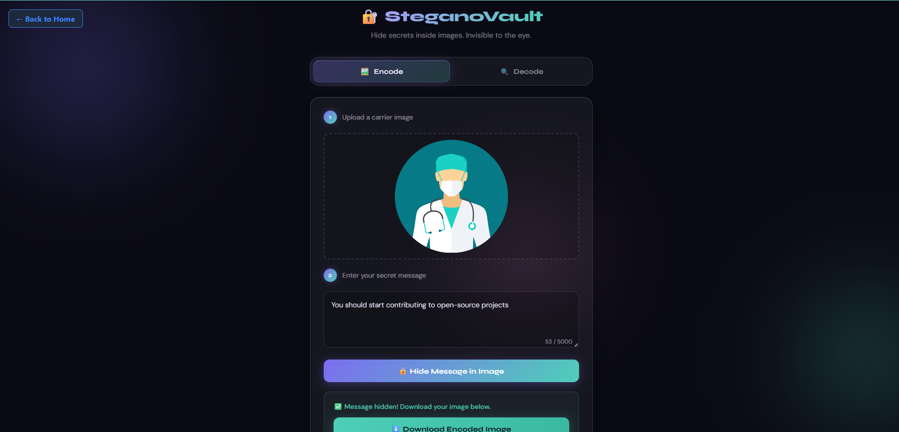
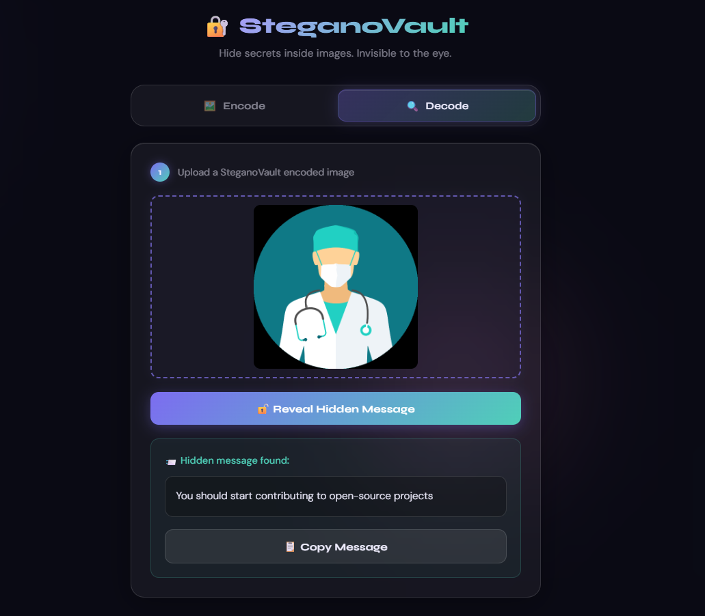

# 🔐 SteganoVault — Image Steganography Tool

A sleek, browser-based tool to **hide secret messages inside images** using LSB (Least Significant Bit) steganography — no backend, no libraries, pure HTML/CSS/JS.

## ✨ Features

- 🖼️ **Encode** — Upload any image and embed a secret text message into it invisibly
- 🔍 **Decode** — Upload an encoded image and instantly reveal the hidden message
- 🎨 Glassmorphism UI with animated background orbs
- 📋 One-click copy of decoded messages
- ⬇️ Download the encoded image as PNG
- 🖱️ Drag & drop support for image upload
- 🔤 Supports full UTF-8 text (emojis, multilingual characters)
- ✅ Character counter (up to 5000 chars)
- 📱 Fully responsive on mobile

## 🧠 How It Works (LSB Steganography)

The tool uses the **Least Significant Bit (LSB)** technique:

1. Each character of your message is converted to its binary representation (8 bits per byte)
2. Each bit is embedded into the **least significant bit** of the **Red channel** of each pixel
3. Changing 1 bit in a pixel's colour value causes a colour change of at most `1/255` — completely invisible to the human eye
4. A unique delimiter (`<<<END>>>`) is appended to mark where the message ends
5. On decode, the tool reads back the LSBs and reconstructs the binary → converts to text → finds the delimiter

## 🛠️ Technologies Used

- HTML5 Canvas API (pixel-level image manipulation)
- CSS3 (glassmorphism, backdrop-filter, animations)
- Vanilla JavaScript (TextEncoder/TextDecoder for UTF-8)

## 🚀 How to Run

1. Open `index.html` in any modern web browser
2. No installation or internet connection required

## 📸 Usage Guide

### Encoding a Message
1. Switch to the **Encode** tab
2. Upload a carrier image (PNG recommended for lossless quality)
3. Type your secret message in the text box
4. Click **Hide Message in Image**
5. Download the encoded image

### Decoding a Message
1. Switch to the **Decode** tab
2. Upload the previously encoded image
3. Click **Reveal Hidden Message**
4. Your secret message appears!

> ⚠️ **Important:** Always use the **downloaded PNG** for decoding. Re-saving or compressing the image (e.g. as JPEG) will destroy the hidden data since lossy compression changes pixel values.

## 📁 File Structure

```
ImageSteganographyTool/
├── index.html    # Main UI
├── style.css     # Glassmorphism styles & animations
├── script.js     # LSB encode/decode logic
└── README.md     # This file
```

## Screenshots
<p align="center">
  
  
</p>

## 👤 Author

Contributing to [100 Days 100 Web Projects](https://github.com/pragya-manna/100_days_100_web_project) as part of GSSoC 2026.

Issue: #6587 — Image Steganography Tool

## 📜 License

MIT — Free to use and modify.