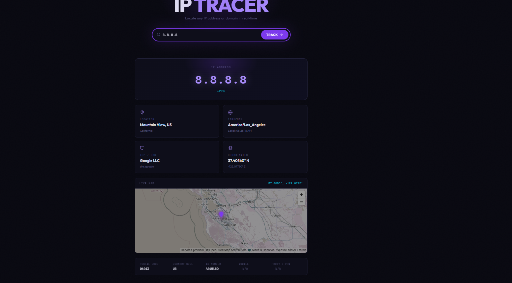

# 🌐 IP Address Tracker

A sleek, dark & modern IP address tracker built with pure HTML, CSS, and JavaScript.

## ✨ Features

- 🔍 Look up **any IP address** (IPv4 / IPv6) or **domain name**
- 📍 Auto-detects and displays your **own IP** on load
- 🗺️ **Live map** showing the geographic location via OpenStreetMap
- 🕐 **Real-time local clock** for the traced location's timezone
- 📡 Shows **ISP, Organization, AS Number**
- 🔒 Detects **Proxy / VPN** usage and **Mobile** networks
- 💎 Dark & Modern UI with smooth animations

## 🛠️ Technologies Used

- HTML5
- CSS3 (CSS Variables, Flexbox, Grid, Animations)
- Vanilla JavaScript (ES6+)
- [ip-api.com](https://ip-api.com) — Free IP geolocation API
- [OpenStreetMap](https://www.openstreetmap.org) — Free map embed

## 🚀 How to Run

1. Open `index.html` in any modern browser
2. Your IP is automatically detected on load
3. Enter any IP or domain in the search bar and click **Track**

## 📸 Screenshots

> Dark modern UI with IP info cards, live map, and details strip.

## 📁 Project Structure

```
IPAddressTracker/
├── index.html   — Markup & layout
├── style.css    — Dark modern styles & animations
├── script.js    — API calls & DOM logic
└── README.md    — Documentation
```

## ⚙️ API Details

Uses [ip-api.com](https://ip-api.com/docs) free tier:

- No API key required
- Rate limit: 45 requests/minute
- Returns: country, city, region, timezone, ISP, coordinates, proxy/VPN detection

## 👤 Author

Built for **100 Days 100 Web Projects**

## screenshot:


