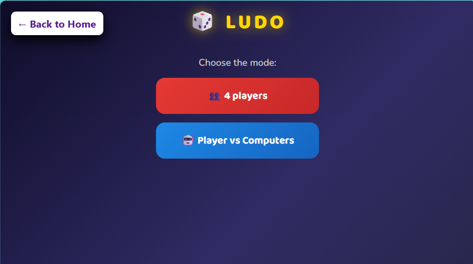
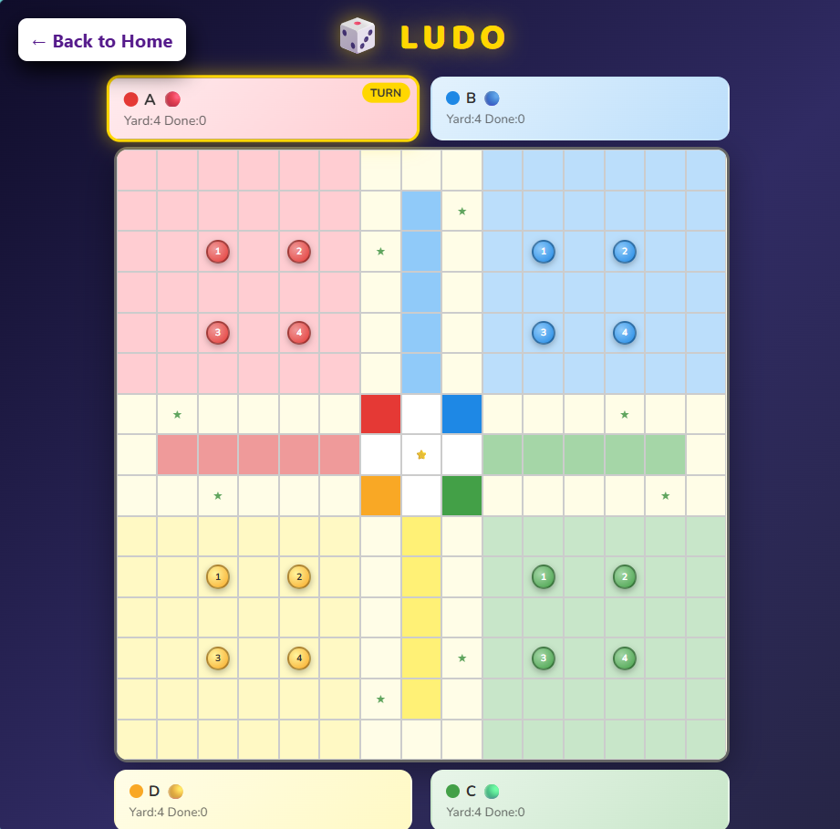

# 🎲 Ludo Game

## 📌 Project Overview

This is a classic Ludo game built using HTML, CSS, and Vanilla JavaScript. The game supports interactive gameplay with animations, AI mode, and a responsive UI.

---

## 🎮 Game Modes

- 👥 4 Player Mode
- 🤖 Player vs Computer Mode

---

## ✨ Features

- Interactive Ludo board
- Dice rolling animation
- AI opponent support
- Turn-based system
- Token capturing logic
- Win celebration with effects
- Responsive design

---

## 🛠️ Tech Stack

- HTML5
- CSS3
- JavaScript (Vanilla JS)
- Font Awesome

---

## 📁 Project Structure

public/
└── Ludo-game/
├── index.html
├── style.css
├── script.js
├── README.md
├── pic1.png
└── pic2.png

---

## 🚀 How to Run

1. Clone the repository
2. Navigate to project folder
3. Open `index.html` in browser
4. Start playing 🎲

---

## 🔮 Future Improvements

- Online multiplayer
- Sound effects
- Save game state
- Mobile optimization

---

## 📸 Screenshots

### Game Screen 1

### Game Screen 2

---

## 🙌 Author

Built as part of GSSoC'26 contribution.
