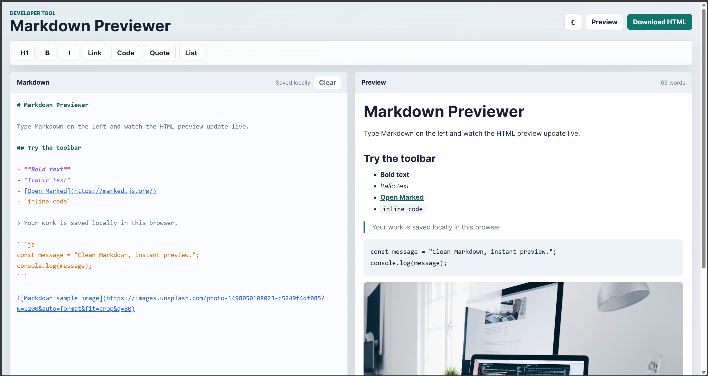
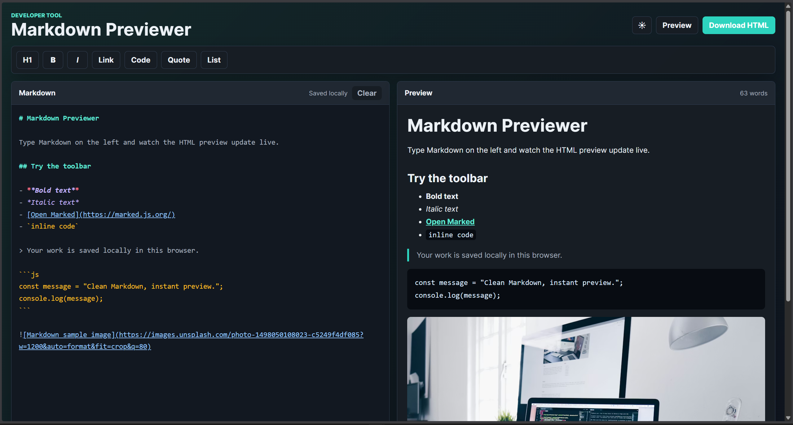

# Markdown Previewer

A clean, responsive split-pane Markdown editor that lets users write Markdown on the left and instantly preview the rendered HTML on the right.

## Features
- Live Markdown preview with a two-pane editor and preview layout
- Supports headings, bold, italic, lists, code blocks, blockquotes, links, images, and tables
- Syntax-highlighted Markdown editor pane
- Toolbar shortcuts for common Markdown formatting
- Toggle between split view and full preview mode
- Light and dark mode toggle with saved theme preference
- Clear button with inline confirmation
- Download rendered content as an HTML file
- Saves work automatically using localStorage
- Responsive design for desktop, tablet, and mobile screens

## Technologies Used
- HTML
- CSS
- JavaScript
- Marked.js

## How to Run
1. Open `index.html` in a web browser
2. Start typing Markdown in the editor
3. Enjoy the live preview!

## Screenshots

## Author
Made with ❤️ by **Akshith**.

- GitHub: [Akshith-cdr](https://github.com/Akshith-cdr)
