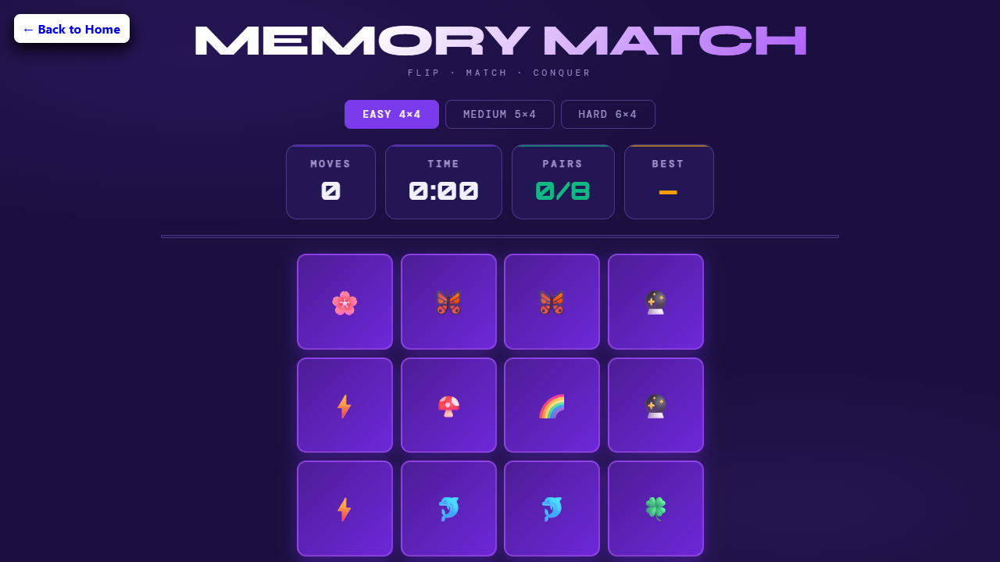

# Memory Match Game

Memory Match is a browser-based card matching game with animated feedback, score tracking, and multiple difficulty levels.

## Features

- Multiple difficulty levels: Easy, Medium, and Hard
- Move, timer, and best-score tracking with `localStorage`
- Hint button for a quick preview of a matching pair
- Victory modal with stats and replay flow
- Confetti animation and victory sound on win
- Responsive layout for desktop and mobile

## How to Play

1. Choose a difficulty level.
2. Press **Start Game** to begin.
3. Flip cards to find matching pairs.
4. Use **Hint** if you need a quick preview.
5. Match every pair to finish the game and view your final stats.

## Setup

This project is a static frontend game.

1. Open `index.html` in a browser, or run it through any local static server.
2. Make sure the project files stay together so the script and audio assets can load correctly.

## Project Structure

- `index.html` - game layout and modals
- `style.css` - styling and responsive UI
- `script.js` - gameplay logic and state handling
- `preview.png` - preview image for the project
- `victory.mp3` - victory sound effect

## Technologies Used

- HTML5
- CSS3
- Vanilla JavaScript
- Font Awesome
- Google Fonts

## Notes

- Progress and best scores are stored locally in the browser.
- The game can be restarted at any time using **Restart** or **Play Again**.
