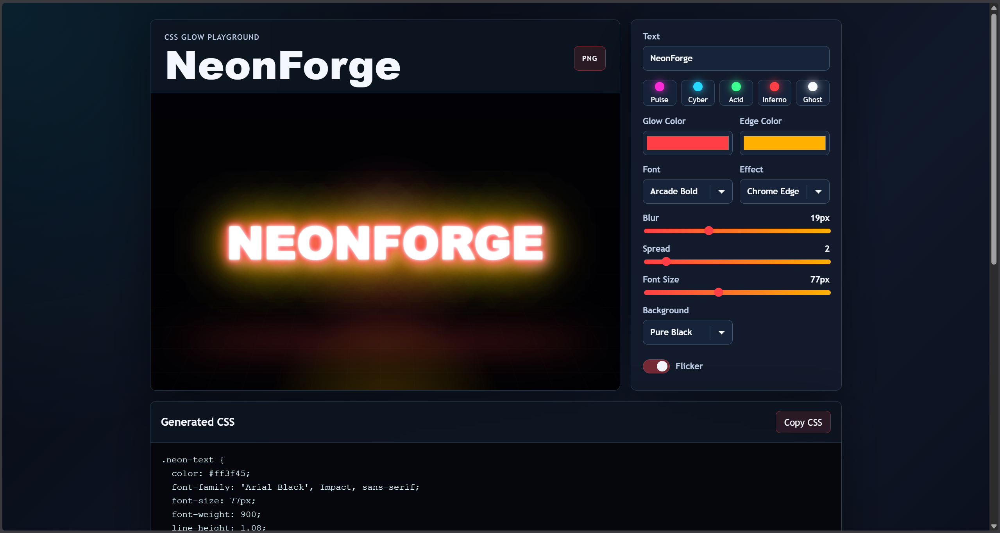

# NeonForge

NeonForge is an interactive CSS neon glow effects playground built with pure HTML, CSS, and JavaScript. It lets users type any text, customize the glow effect in real time, preview different neon styles, copy the generated CSS, and download the final preview as a PNG image.

This project is designed as a small creative frontend tool that can be added easily to an open-source project collection. It does not use any frameworks, external APIs, build tools, or dependencies.

## Features

- Live neon text preview that updates instantly
- Custom text input for creating your own sign
- Primary glow color and secondary edge color pickers
- Blur intensity control
- Glow spread control
- Font size slider
- Font family selector
- Multiple neon presets: Pulse, Cyber, Acid, Inferno, and Ghost
- Multiple effect styles: Glass Tube, Chrome Edge, Glitch Pulse, and Clean Glow
- Background selector with dark, black, violet, teal, and custom color modes
- Flicker animation toggle
- Live generated CSS code block
- One-click copy button for generated CSS
- Download preview as PNG using the Canvas API
- Fully responsive layout for desktop and smaller screens

## Technologies Used

- HTML
- CSS
- JavaScript
- CSS text-shadow
- CSS animations
- Clipboard API
- Canvas API

## How It Works

NeonForge updates the preview by listening to changes from the input controls. Whenever the user changes text, colors, blur, spread, font, background, or animation settings, JavaScript updates the preview styles and regenerates the CSS code shown below the editor.

The neon effect is mainly created with layered `text-shadow` values. Different presets combine primary and secondary glow colors to create stronger visual effects. The PNG download feature draws the current preview onto a canvas and exports it as an image.

## Project Structure

```text
NeonForge/
|-- index.html
|-- style.css
|-- script.js
|-- screenshots/
|   `-- image.png
`-- README.md
```

## How to Run

1. Download or clone the project.
2. Open `index.html` in any modern web browser.
3. Type your text and customize the neon effect.
4. Copy the generated CSS or download the preview as a PNG.

No installation is required.

## Usage

1. Enter your custom text in the text field.
2. Choose a preset to start quickly.
3. Adjust the glow color, edge color, blur, spread, and font size.
4. Select an effect style and background.
5. Toggle flicker animation on or off.
6. Copy the generated CSS and use it in your own project.

## Screenshots



## Future Improvements

- Add more neon presets
- Add export options for HTML and CSS together
- Add saved custom themes
- Add more background styles
- Add random neon effect generator
- Improve PNG export for multi-line text

## Author

Akshith V

GitHub: [@Akshith-cdr](https://github.com/Akshith-cdr)
