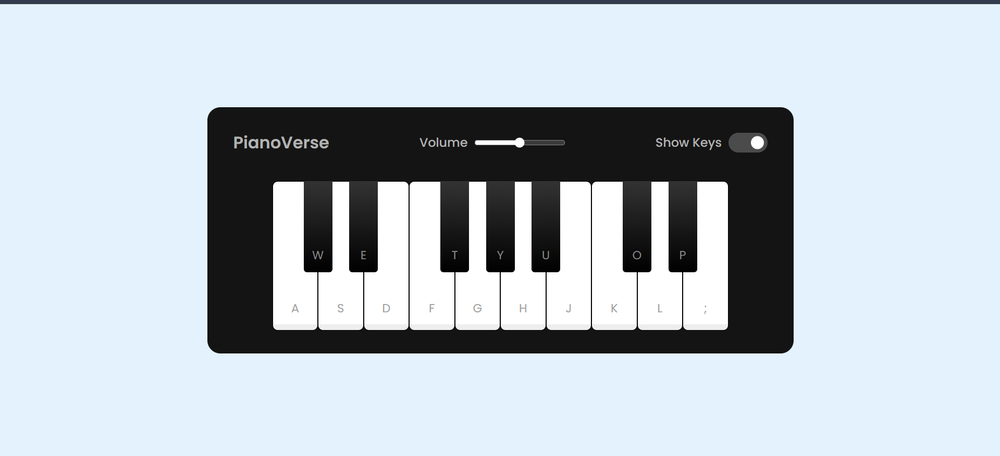

# PianoVerse

A lightweight, responsive browser-based piano you can play with your keyboard or by tapping on screen.

## Features

- Play notes using keyboard keys or mouse clicks
- Full touch support for mobile and tablet devices
- Volume control slider
- Toggle to show or hide key labels
- Fluid responsive layout that adapts to any screen size

## Technologies Used

- HTML
- CSS
- JavaScript

## How to Run

1. Open `index.html` in a web browser
2. Press the keyboard keys or click/tap the piano keys to play
3. Enjoy the project!

## Screenshots

## Author

Kshitij Maurya