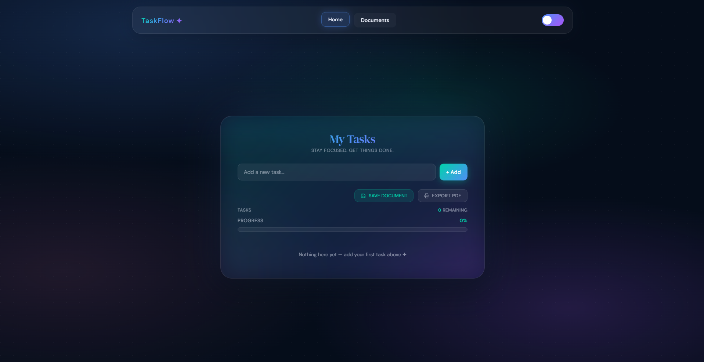
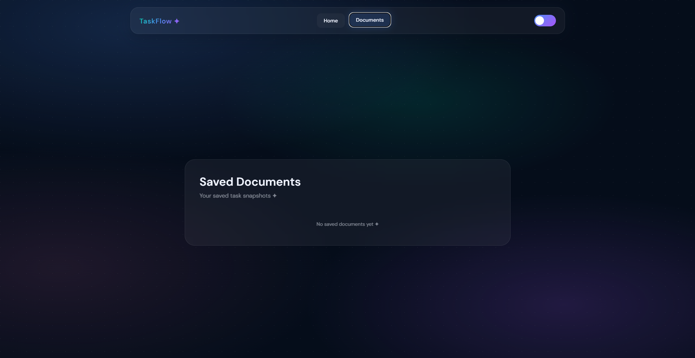
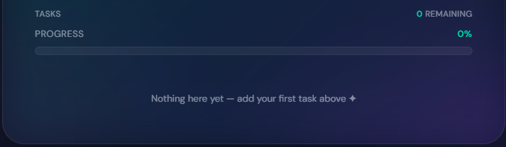
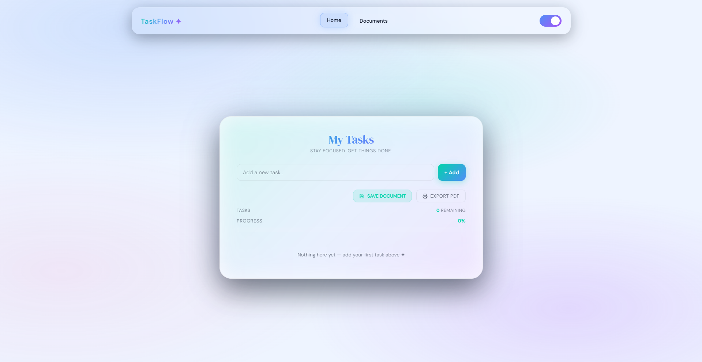

# TaskFlow:  Modern To-Do List Web Application

## Description

TaskFlow is a modern and responsive To-Do List web application designed to help users manage daily tasks efficiently with a clean and premium user interface. The project focuses on productivity, simplicity, and enhanced user experience through modern frontend design and interactive features.

## Features


* Add, complete, and delete tasks
* Dynamic animated progress bar
* Save task snapshots as documents
* Dedicated Documents section with previews
* Dark/Light theme toggle
* Responsive modern UI
* Glassmorphism-inspired design
* LocalStorage support for persistent data
* Smooth animations and interactions

## Technologies Used
- ➕ Add, edit, complete, and delete tasks
- 🎯 Filter tasks by status and category
- 🌈 5 Beautiful UI themes (Sunset, Ocean, Forest, Midnight, Aurora)
- 💾 Local storage support (data persists after refresh)
- 📊 Live statistics (total, completed, pending tasks)
- 📱 Fully responsive design (mobile + desktop)
- ✨ Smooth animations and transitions
- 🔔 Toast notifications for user actions
- 📄 Export tasks as styled PDF using jsPDF
- 📁 Document history for exported files
- 🧩 Drag and Drop Kanban Workflow  
  - Pending  
  - In Progress  
  - Completed
  
---


* HTML5
* CSS3
* JavaScript ES6
* LocalStorage API

## Installation/Setup

1. Clone the repository:

```bash id="xkzix7"
git clone <repository-link>
```

2. Open the project folder:

```bash id="0fwb55"
cd TaskFlow
```

3. Run the project:

* Open `index.html` in your browser

## Usage

* Add tasks using the input field
* Mark tasks as completed
* Delete unwanted tasks
* Track completion progress using the progress bar
* Save task snapshots in the Documents section
* Toggle between Dark and Light themes

## Screenshots

### Home Page UI


### Documents Section


### Progress Tracking


### Dark/Light Theme Interface


## Contributing

Contributions are welcome.

To contribute:

1. Fork the repository
2. Create a feature branch
3. Commit your changes
4. Push the branch
5. Open a Pull Request

## License

MIT License

## Author

Indrayani Verulkar
