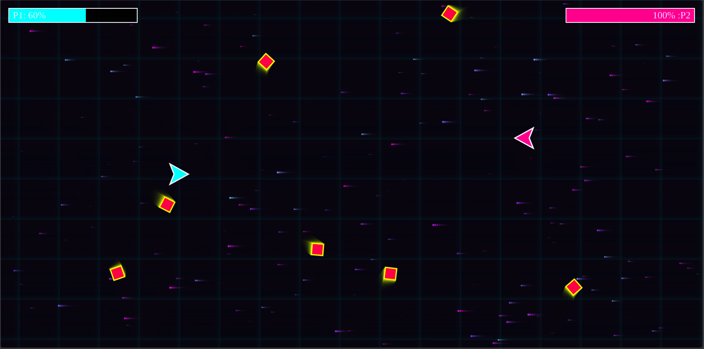
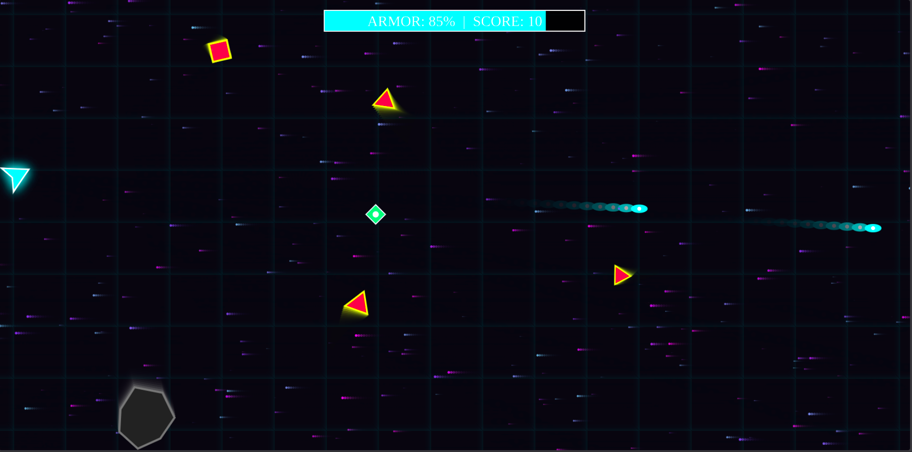

# 🚀 ULTIMATE BHASAD

An intense, zero-dependency, high-performance HTML5 Canvas arcade space shooter fueled by a custom **procedural 8-bit synthesizer audio engine**. Built purely with raw web technologies—**0MB assets, 0MB internet, zero external framework overhead, and zero asset loading lag.**

---

## 🎨 Choose Your Bhasad: Game Modes

The game is modularly split into specialized performance-tuned engine architectures:

### 1. 🌌 Lone Wolf Mode (`game1.js`)

- **Single-Player Survival Experience**: It's you against a relentless galaxy.
- **🎯 360° Mouse Aiming**: Complete arcade-style fluid movement. Move with **WASD / Arrows** and aim/shoot dynamically with your mouse cursor or **Spacebar**.
- **Rebalanced Difficulty**: Fine-tuned drone swarm counts and Boss properties scaled perfectly for a single pilot.

### 2. ⚔️ Takaaar Mode (`game2.js`)

- **Local Multiplayer Arena**: Battle your friend side-by-side on a single screen.
- **Balanced Dual Controls**:
  - **Player 1**: Move with `W`, `A`, `S`, `D` | Fire with **Left-Shift**.
  - **Player 2**: Move with **Arrow Keys** | Fire with **Right-Shift**.
- **Co-op or Betrayal**: Coordinate your movements to dodge incoming projectiles, team up against the galaxy, or play dirty and out-maneuver each other using the powerup mechanics.

---

## Screenshot

  


## ⚡ Key Engineering Features

- **🎹 Procedural Audio Integration**: Bypasses browser audio file overheads and network issues completely. Synthesizes retro laser beams, explosions, picking up powerups, and a deep **robotic devil laugh** procedurally on the fly using the browser's native **Web Audio API**.
- **🥁 Synthesized Cyberpunk BGM**: Generates a continuous dynamic techno-synth bassline in real-time as you play.
- **🌀 Advanced Performance VFX**: Implements high-frequency exhaust particle trails, expanding shockwaves, neon blooms (`globalCompositeOperation = 'lighter'`), and micro-attenuated screen shake effects without dropping below 60 FPS.
- **👹 Maha-Bhasad AI Boss**: Surpass the 30-second mark to trigger a multi-phase corporate AI security boss that spawns massive bullet-hell patterns across the viewport.
- **🛠️ Garbage-Collector Optimized**: Leverages micro-managed array splicing loops to completely nullify structural processing stutter or memory spikes during heavy gameplay phases.

---

## 🧪 The 16 Power-Up Protocols

Destroying floating space scrap or enemy drones releases microtech pods containing one of sixteen extreme combat modifiers:

| Power-Up Class  | Tactical Label     | Protocol Manifestation                                                             |
| :-------------- | :----------------- | :--------------------------------------------------------------------------------- |
| **💚 HEALTH**   | `REPAIR +30`       | Patches structural shielding by restoring 30% HP.                                  |
| **🔥 RAPID**    | `OVERDRIVE`        | Significantly lowers structural cooldown for massive bullet output.                |
| **🛡️ SHIELD**   | `AEGIS SHIELD`     | Deploys an energy field completely blocking all forms of damage.                   |
| **⚡ SPEED**    | `NITRO BOOST`      | Amplifies thruster output and ship velocity by 1.8x.                               |
| **👻 GHOST**    | `PHANTOM CLOAK`    | Phase shifts the hull, making you completely immune to collision checks.           |
| **❄️ FREEZE**   | `CRYOGENIC STASIS` | Traps your opponents or surrounding threats in slow-motion ice cages.              |
| **📡 EMP**      | `EMP BLAST`        | Instantly purges and deletes all opposing active projectiles from screen space.    |
| **🩸 VAMP**     | `VAMPIRE PROTOCOL` | Absorbs bio-matter energy; siphons 50% of dealt damage back into your healthpool.  |
| **🍇 SCATTER**  | `SCATTER SHOT`     | Modifies weapons array to unleash a devastating three-way shotgun spread.          |
| **🟢 PIERCE**   | `RAILGUN AMMO`     | Upgrades ammunition to bypass collision limits, piercing through multiple targets. |
| **🧠 REVERSE**  | `NEURO-HACK`       | Brain-hacks your target, swapping all inverted steering vectors for 4 seconds.     |
| **🔮 TELEPORT** | `QUANTUM SHIFT`    | Shifts space-time, warping targets randomly across arena coordinates.              |
| **🔎 SHRINK**   | `MICRO-TECH`       | Minimizes structural hitbox space, allowing effortless dodging.                    |
| **💥 NUKE**     | `ORBITAL STRIKE`   | Desynchronizes surrounding matrix nodes, vaporizing all active drones.             |
| **🧲 GIANT**    | `JUGGERNAUT`       | Enlarges ship structure, heavily scaling weapon caliber size and base payload.     |
| **⚡ LASER**    | `PLASMA BEAM`      | Overclocks capacitors to fire hyper-speed plasma rounds at a near-instant rate.    |

---

## 🛠️ Installation & Setup Execution

The ecosystem is designed as a direct plug-and-play architecture requiring zero compilation packages or package managers.

### 1. Repository Directory Mapping

Ensure your project folder structure matches the layout blueprint below:

````text
UltimateBhasad/
├── index.html     # Mode Selection UI & Main Matrix Script Injector
├── game1.js       # Single Player Engine Source
└── game2.js       # Multiplayer Engine Source

### 2. Live Server Execution
Due to browser security protocols surrounding the programmatic initialization of the `AudioContext` and dynamic file fetching via scripting, opening the `index.html` file directly as a local file preview is blocked.

1. Open your workspace folder inside your code editor (e.g., VS Code).
2. Launch the **Live Server** extension or run a local HTTP server using Python/NodeJS:
   ```bash
   # Python 3 Server Command
   python3 -m http.server 8000
````
