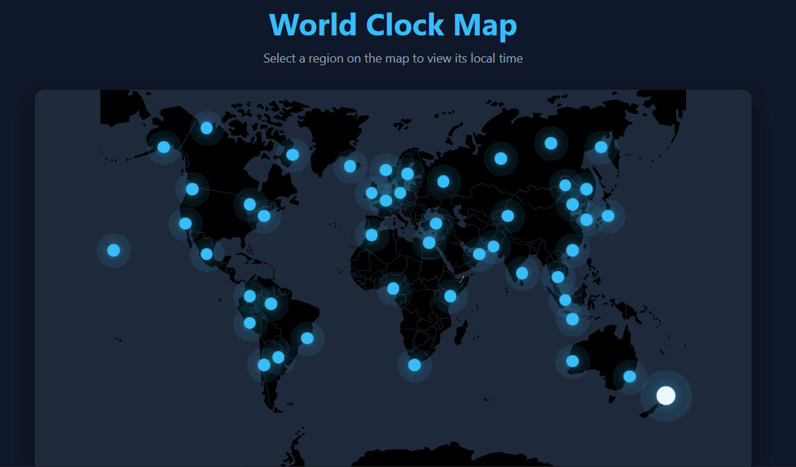

# Interactive World Clock Map

A highly visual and intuitive web application to check times across the globe. Hover and click on different global regions to dynamically view real-time clocks and dates for specific time zones without manual calculations.

## Features
- **Interactive Global Map**: Visual pinpoints corresponding to major global cities.
- **Real-Time Clock**: Live ticking clocks for selected regions updating accurately to the second.
- **Time Zone Handling**: Utilizes JavaScript's native `Intl.DateTimeFormat` API for pristine time zone conversions and daylight savings adjustments.
- **Responsive & Modern UI**: CSS animations, dark-mode styling, and clean data presentation.

## Technologies Used
- HTML5
- CSS3 (Variables, Keyframe Animations, Flexbox)
- JavaScript ES6 (Intl API, DOM Manipulation)

## How to Run
1. Navigate to the `/public/WorldClockMap` directory.
2. Open `index.html` in any web browser.
3. Click on the animated pins on the map to switch time zones.

## Screenshots

## Author
[notslazer](https://github.com/notslazer)