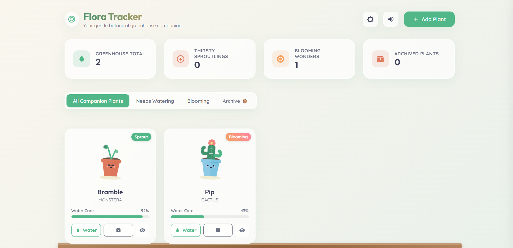

# 🌿 Flora Tracker

A modern and interactive web application that helps plant enthusiasts organize, monitor, and care for their plants through a clean and engaging digital greenhouse interface.

Whether you're taking care of a single houseplant or building your own indoor garden, Flora Tracker makes it easy to keep track of watering schedules, plant growth, and personal gardening notes.

---

## ✨ Features

- 🌱 Add and manage multiple plants
- 💧 Track watering schedules
- 📊 Dashboard with plant statistics
- 🌸 View blooming and healthy plants
- 🚨 Identify plants that need watering
- 📦 Archive inactive plants
- 🌙 Light/Dark theme toggle
- 🔊 Audio toggle
- 📝 Personal greenhouse journal for every plant
- 📈 Growth progress tracking
- 🎨 Multiple plant species selection
- 🪴 Decorative pot customization
- 📱 Responsive design

---

## 📸 Preview

> Add a screenshot of the application here.

Example:

```
preview.png
```

```md

```

---

## 🛠 Technologies Used

- HTML5
- CSS3
- JavaScript (Vanilla JS)
- SVG Icons

---

## 📂 Project Structure

```
Flora-Tracker/
│── index.html
│── style.css
│── app.js
│── plants.js
│── preview.png
└── README.md
```

---

## 🚀 Getting Started

### Clone the repository

```bash
git clone <repository-url>
```

### Open the project

Navigate to the project folder.

### Run the application

Open `index.html` in your browser.

No additional installation or dependencies are required.

---

## 🌱 How to Use

1. Click **Add Plant**.
2. Enter the plant name.
3. Select a plant species.
4. Choose a decorative pot.
5. Set the watering frequency.
6. Save the plant.
7. Monitor watering schedules.
8. Track plant growth.
9. Add notes in the Greenhouse Diary.
10. Archive plants when required.

---

## 📊 Dashboard Overview

The dashboard provides:

- Total plants
- Plants requiring watering
- Blooming plants
- Archived plants

---

## 🌼 Supported Plant Types

- Monstera
- Succulent
- Fern
- Cactus
- Snake Plant

---

## 🎨 Themes

Flora Tracker supports:

- ☀️ Day Theme
- 🌙 Night Theme

Users can switch themes using the theme toggle button.

---

## 🔔 Notifications

The application provides toast notifications for important actions such as:

- Plant added
- Plant updated
- Plant archived
- Successful operations

---

## 📖 Greenhouse Diary

Every plant includes a personal journal where users can:

- Add observations
- Track growth milestones
- Record watering notes
- Maintain a gardening history

---

## 💡 Future Enhancements

- Cloud synchronization
- User authentication
- Plant disease detection
- Weather integration
- Watering reminders
- Plant image upload
- Search and filtering
- Export plant data
- Offline support
- Progressive Web App (PWA)

---

## 🤝 Contributing

Contributions are welcome.

1. Fork the repository.
2. Create a new branch.
3. Make your changes.
4. Commit your changes.
5. Push your branch.
6. Open a Pull Request.

---

## 📜 License

This project is licensed under the MIT License unless specified otherwise.

---

## 👨‍💻 Author

Developed with ❤️ for plant lovers and gardening enthusiasts.

---

## ⭐ Show Your Support

If you like this project, consider giving it a ⭐ on GitHub to support future development.
