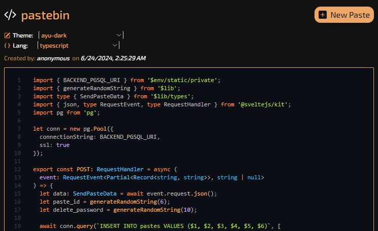

# pastebin

A pastebin service that allows sharing code with beautiful themes and multiple languages support.


## setup

* Install the dependences with package manager of your choice ( using `yarn` here )
```sh
yarn
```

* Create an `.env` file and add the connection url to your postgres database, Example
```
# .env
BACKEND_PGSQL_URI="your connection url here"
```

* Start the server using `yarn dev` or build using `yarn build`

<p align="center">

</p>
